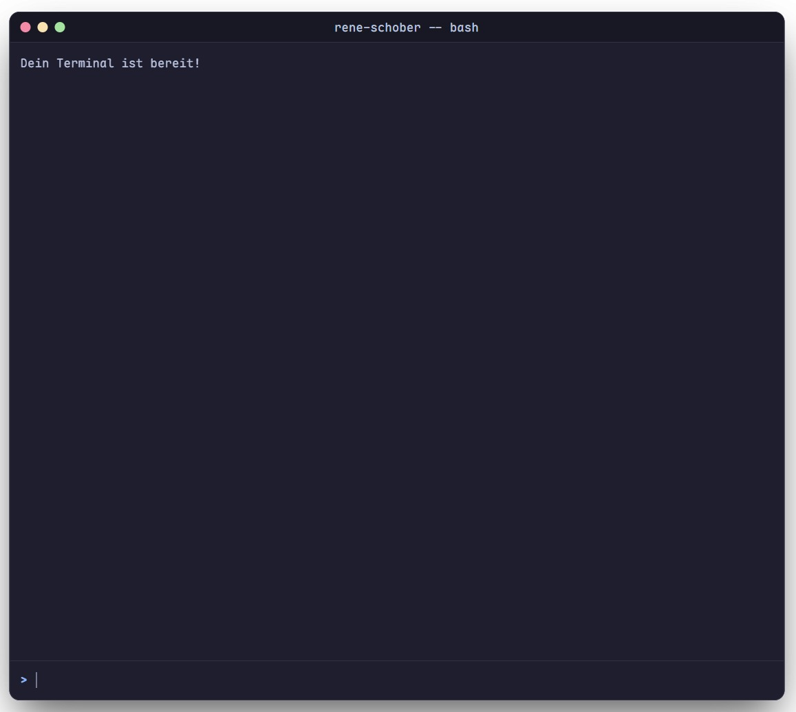
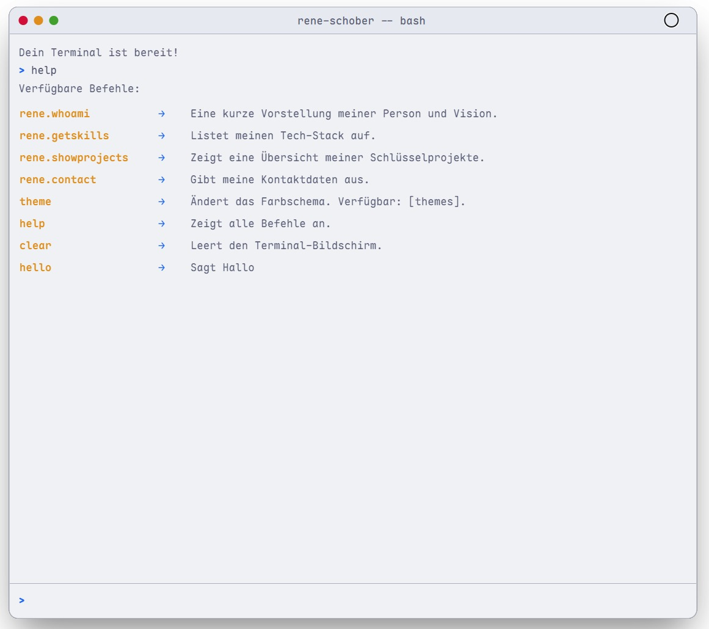

# Interaktive Bewerbung: @codingruo/r3ne-sch0b3r.io


Hallo! Dies ist keine gewöhnliche NPM-Bibliothek – es ist meine interaktive Bewerbung als Full-Stack Entwickler.

Statt eines traditionellen Motivationsschreibens habe ich dieses kleine, framework-unabhängige JavaScript-Package entwickelt. Es rendert ein voll funktionsfähiges Terminal-Interface, das meine Fähigkeiten, Projekte und meine Persönlichkeit auf eine Art und Weise präsentiert, die mir als Entwickler am Herzen liegt: durch Code.

---

## 🚀 Live-Demo

**Neugierig? Probier es direkt auf meiner Portfolio-Webseite aus:**

**[https://r3ne-sch0b3r.io](https://r3ne-sch0b3r.io)**

<div align="center">
  
  
  
</div>

---

## ✨ Features

* **Interaktives Terminal-Interface:** Ein voll funktionsfähiges Terminal im Browser.
* **Framework-unabhängig:** Mit reinem TypeScript und DOM-Manipulation erstellt, lässt es sich in jedes Projekt (React, Vue, Svelte, etc.) integrieren.
* **Anpassbare Befehle:** Das System ist so konzipiert, dass neue Befehle einfach über ein Konfigurationsobjekt hinzugefügt werden können.
* **Leichtgewichtig:** Kein unnötiger Ballast, nur das Nötigste für eine saubere und performante Darstellung.

---

## 🛠️ Installation & Verwendung

Obwohl dies primär ein Bewerbungsprojekt ist, wurde es wie ein echtes Open-Source-Package entwickelt und ist auf NPM verfügbar.

### 1. Installation:

```bash
npm install @codingruo/r3ne-sch0b3r.io
# oder pnpm
pnpm add @codingruo/r3ne-sch0b3r.io
```

### 2. Verwendung:

```jsx
import { useEffect, useState } from 'react'

import { createInteractiveCV } from '@codingruo/r3ne-sch0b3r.io';
import type { Terminal } from '@codingruo/r3ne-sch0b3r.io';
import '@codingruo/r3ne-sch0b3r.io/styles.css';

function App() {
    const [terminal, setTerminal] = useState<Terminal | null>(null)

    useEffect(() => {

        const myCommands = {
            'hello': {
                description: 'Sagt Hallo',
                output: 'Hallo Welt! Dies ist ein benutzerdefinierter Befehl.'
            },
        };

        const terminalInstance = createInteractiveCV('terminal-container', {
            customCommands: myCommands,
            height: '500px',
            width: '600px',
        });
        setTerminal(terminalInstance);
    }, []);

    return (
        <>
            <button onClick={() => terminal?.open()}>Klick</button>
            <div id="terminal-container" />
        </>
    )
}

export default App

```
---

## 🖥️ Verfügbare Befehle in meiner Bewerbung

| Befehl | Beschreibung |
|--------|--------------|
| `rene.whoami()` | Eine kurze Vorstellung meiner Person und Vision. |
| `rene.getSkills()` | Listet meinen Tech-Stack auf. |
| `rene.showProjects()` | Zeigt eine Übersicht meiner Schlüsselprojekte. |
| `rene.contact()` | Gibt meine Kontaktdaten aus. |
| `help` | Zeigt diese Hilfe an. |
| `clear` | Leert den Terminal-Bildschirm. |

---

## 👤 Autor

**René Schober**

- GitHub: [@codingruo](https://github.com/codingruo)
- LinkedIn: [@linkedIn](https://www.linkedin.com/in/ren%C3%A9-schober-3662aa36b/)

---

## 📄 Lizenz

Dieses Projekt ist unter der MIT-Lizenz lizenziert.